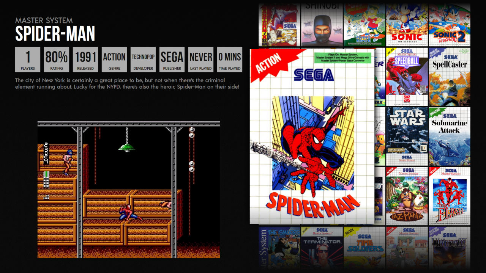
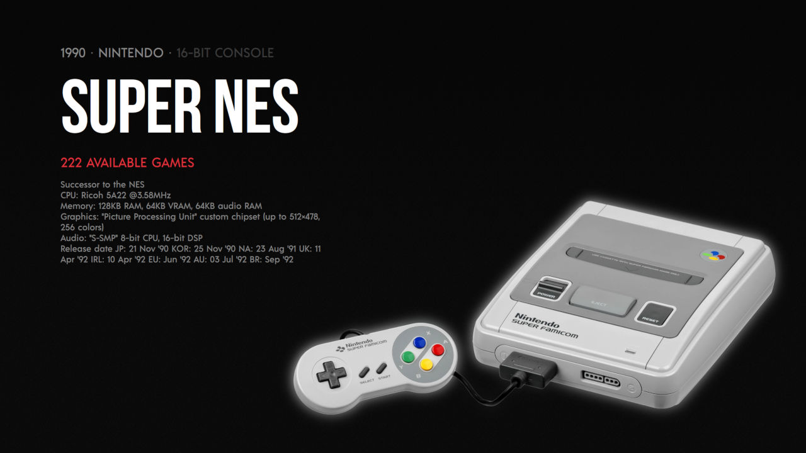

# Slick theme for Pegasus

A slick theme focusing on simplicity and usability.

## Installation

[Download](https://github.com/buzz/pegasus-theme-slick/archive/master.zip) and
extract the theme to your [theme
directory](http://pegasus-frontend.org/docs/user-guide/installing-themes). You
can then select it in the settings menu of Pegasus.

## Platforms

The theme features technical details and a background images for the following platforms.

`amigacd32`, `amiga`, `amstradcpc`, `arcade`, `atari2600`, `atari7800`,
`atarilynx`, `c64`, `dreamcast`, `famicom`, `fds`, `gamegear`, `gba`, `gbc`,
`gb`, `mastersystem`, `megadrive`, `n64`, `naomi`, `neogeo`, `nes`, `ngpc`,
`pcenginecd`, `pcengine`, `pc`, `ps2`, `ps3`, `psx`, `saturn`, `scummvm`,
`sega32x`, `segacd`, `sfc`, `sg-1000`, `sgb`, `snes`, `switch`, `vectrex`,
`x68000`

## Supported metadata

- `boxFront`
- `logo`
- `poster`
- `screenshot`
- `video`

## Credits

Based on [Flixnet theme](https://github.com/mmatyas/pegasus-theme-flixnet) by
[mmatyas](https://github.com/mmatyas).

### Images

- Amstrad CPC, CC BY-SA 2.0 FR, Photograph by [Rama](https://commons.wikimedia.org/wiki/File:Amstrad_CPC_464-IMG_4849.JPG)
- Arcade, CC BY 2.0 FR, Photograph by [Steven Miller](https://www.flickr.com/photos/aloha75/4906597504/)
- Atari 2600, Public domain, Photograph by [Evan-Amos](https://commons.wikimedia.org/wiki/File:Atari-2600-Wood-4Sw-Set.png)
- Atari 7800, Public domain, Photograph by [Evan-Amos](https://commons.wikimedia.org/wiki/File:Atari-7800-wControl-Pad-L.jpg)
- Atari Lynx, Creative Commons Attribution-Share Alike 3.0 Unported, Photograph by [Evan-Amos](https://commons.wikimedia.org/wiki/File:Atari-Lynx-I-Handheld.jpg)
- Amiga 500, CC BY 2.5, Photograph by [Bill Bertram](https://commons.wikimedia.org/wiki/File:Leander_Amiga500.jpg)
- Amiga CD32, Public domain, Photograph by [Evan-Amos](https://commons.wikimedia.org/wiki/File:Amiga-CD32-wController-L.jpg)
- Commodore 64, Public domain, Photograph by [Evan-Amos](https://commons.wikimedia.org/wiki/File:Commodore-64-Computer-FL.jpg)
- Dreamcast, CC BY-SA 3.0, Photograph by [Evan-Amos](https://commons.wikimedia.org/wiki/File:Dreamcast-Console-Set.png)
- Famicom, Public domain, Photograph by [Evan-Amos](https://commons.wikimedia.org/wiki/File:Nintendo-Famicom-Disk-System.jpg)
- Famicom Disk System, Public domain, Photograph by [Evan-Amos](https://commons.wikimedia.org/wiki/File:Nintendo-Famicom-Disk-System.jpg)
- Game Boy, Public domain, Photograph by [Evan-Amos](https://commons.wikimedia.org/wiki/File:Game-Boy-FL.jpg)
- Game Boy Advance, Public domain, Photograph by [Evan-Amos](https://commons.wikimedia.org/wiki/File:Nintendo-Game-Boy-Advance-Milky-Blue-FL.png)
- Game Boy Color, Public domain, Photograph by [Evan-Amos](https://commons.wikimedia.org/wiki/File:Nintendo-Game-Boy-Color-FL.png)
- Game Gear, Public domain, Photograph by [Evan-Amos](https://commons.wikimedia.org/wiki/File:Game-Gear-Handheld.jpg)
- IBM PC, CeCILL, Photograph by [Rama & Musée Bolo](https://en.wikipedia.org/wiki/File:IBM_PC-IMG_7271_(transparent).png)
- NES, Public domain, Photograph by [Evan-Amos](https://commons.wikimedia.org/wiki/File:NES-Console-Set.jpg)
- Nintendo 64, Public domain, Photograph by [Evan-Amos](https://commons.wikimedia.org/wiki/File:N64-Console-Set.jpg)
- Nintendo Switch, Public domain, Photograph by [Evan-Amos](https://commons.wikimedia.org/wiki/File:Nintendo-Switch-Console-Docked-wJoyConRB.jpg)
- Sega Saturn, Public domain, Photograph by [Evan-Amos](https://commons.wikimedia.org/wiki/File:Sega-Saturn-Console-Set-Mk1.png)
- Sega CD, Public domain, Photograph by [Evan-Amos](https://commons.wikimedia.org/wiki/File:Sega-CD-Model1-Set.jpg)
- Sega CD 32X, Public domain, Photograph by [Evan-Amos](https://commons.wikimedia.org/wiki/File:Sega-Genesis-Model2-32X.png)
- Sega Master System, Public domain, Photograph by [Evan-Amos](https://commons.wikimedia.org/wiki/File:Sega-Master-System-Set.jpg)
- Sega Naomi, Personal use only, https://www.kindpng.com/imgv/iiJibbT_sega-naomi-arcade-png-transparent-png/
- Sega Mega Drive, Public domain, Photograph by [Evan-Amos](https://commons.wikimedia.org/wiki/File:Sega-Mega-Drive-EU-Mk1-wController-FL.jpg)
- Sega SG-1000, CC BY-SA 3.0, Photograph by [Evan-Amos](https://en.wikipedia.org/wiki/File:Sega-SG-1000-Console-Set.jpg)
- Super Famicom, Public domain, Photograph by [Evan-Amos](https://en.wikipedia.org/wiki/File:SNES-Mod1-Console-Set.jpg)
- Super GameBoy, Public domain, Photograph by [Evan-Amos](https://commons.wikimedia.org/wiki/File:Nintendo-Super-Game-Boy.jpg)
- Super Nintendo Entertainment System, Public domain, Photograph by [Evan-Amos](https://commons.wikimedia.org/wiki/File:Nintendo-Super-Famicom-Set-FL.jpg)
- Neo Geo, Public domain, Photographs by Evan-Amos [1](https://commons.wikimedia.org/wiki/File:Neo-Geo-AES-Controller-FR.jpg) [2](https://commons.wikimedia.org/wiki/File:Neo-Geo-AES-FL.png)
- Neo Geo Pocket, Public domain, Photographs by [Evan-Amos](https://commons.wikimedia.org/wiki/File:Neo-Geo-Pocket-Color-Blue-Left.png)
- PlayStation, Public domain, Photograph by [Evan-Amos](https://commons.wikimedia.org/wiki/File:PlayStation-SCPH-1000-with-Controller.jpg)
- PlayStation 2, Public domain, Photograph by [Evan-Amos](https://commons.wikimedia.org/wiki/File:Sony-PlayStation-2-30001-wController-L.png)
- PlayStation 3, Public domain, Photograph by [Evan-Amos](https://commons.wikimedia.org/wiki/File:Sony-PlayStation-3-2001A-wController-L.jpg)
- ScummVM logo, GPLv2, [The ScummVM Team](https://commons.wikimedia.org/wiki/File:ScummVM_%22Modern_Remastered%22_Logo.svg)
- TurboGrafx 16, Public domain, Photograph by [Evan-Amos](https://en.wikipedia.org/wiki/File:TurboGrafx16-Console-Set.jpg)
- TurboGrafx 16 CD, Public domain, Photograph by [Evan-Amos](https://commons.wikimedia.org/wiki/File:NEC-TurboGrafx-16-CD-FL.jpg)
- Vectrex, CC BY-SA 3.0, Photograph by [Evan-Amos](https://commons.wikimedia.org/wiki/File:Vectrex-Console-Set.jpg)
- X68000, Private image, Photograph by [HCKblog](https://hckblog.wordpress.com/2013/06/05/hck-vs-the-sharp-x68000/)

## License

Content licensed under [CC-BY-NC-SA](http://creativecommons.org/licenses/by-nc-sa/4.0/) unless otherwise noted.

Font Awesome icons licensed under [Creative Commons Attribution 4.0 International](https://creativecommons.org/licenses/by/4.0/).
